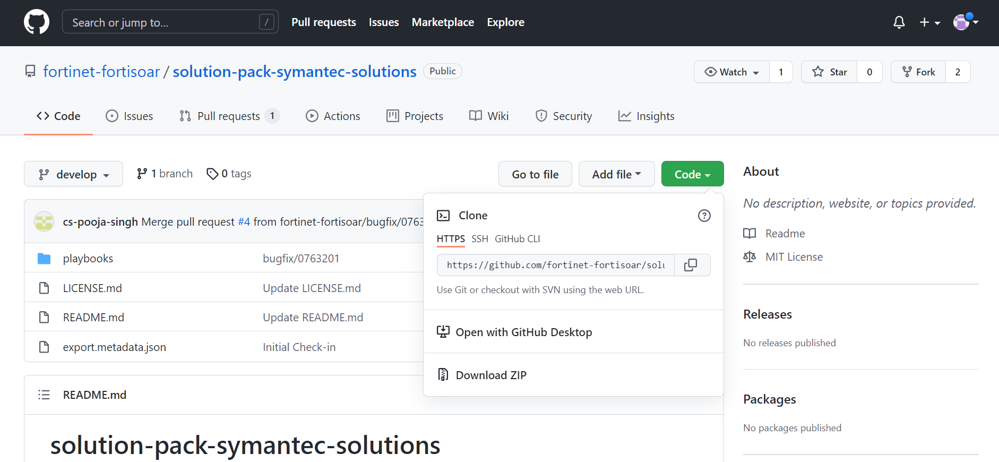

# Symantec Solutions Incident Response Solution Pack 7.0.2

## Overview

This article describes the FortiSOAR™ Symantec Solutions Incident Response Content Pack (solution-pack-multi-tenancy). This content pack enables users to experience the power and capability of FortiSOAR™ incident response for Symantec Solutions. 

FortiSOAR™ is built using modular architecture and the FortiSOAR™ Incident Response Content Pack is the implementation of the best practices to configure and use FortiSOAR™ in an optimal manner. The FortiSOAR™ Incident Response Content Pack also contains a lot of sample/simulation/training data that enables you to experience FortiSOAR™ without having all the devices.

## Deploying Symantec Solutions IR Solution Pack

**Important**: Before you deploy the solution pack, ensure that you have deployed the FortiSOAR™ Incident Response Solution Pack (solution-pack-incident-response).

Use the following procedure as a *root* user to deploy the solution pack:

1. Log onto the Solution Pack GIT repo (https://github.com/fortinet-fortisoar/solution-pack-symantec-solutions](https://github.com/fortinet-fortisoar/solution-pack-symantec-solutions)) using your credentials.
2. Click the **Code** button and select the **Download ZIP** option.
   
3. Log into your FortiSOAR instance, and on the left-navigation, click **Import Wizard**.
   
4. On the `Import Wizard` page, click **Import From File** and selected the solution pack zip that you have downloaded, and navigate through the Import Wizard.
   
   **Note**: It is recommended not the change any configurations or options of the imported solution pack zip file.
   Once the import is successfully completed, you can use the Symantec Solutions IR solution pack.
